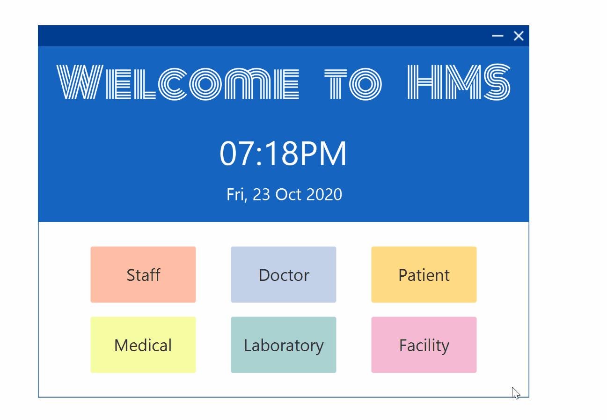

# Hospital Management Application
Java Project on Hospital Management System

The GUI program can be downloaded in the releases section.

## Learning objectives:
1. To familiarize myself with OOP concepts using Java.

## Program functions:
1. View and add records of staff, doctor, patient, medical, laboratory, and facility.

## List of Dependencies used:
- Java SE 8
- JavaFX 8
- (JFoenix for Java 8)[https://github.com/jfoenixadmin/JFoenix]

## Hightlight features:
1. Input validation
2. Autocompletion

