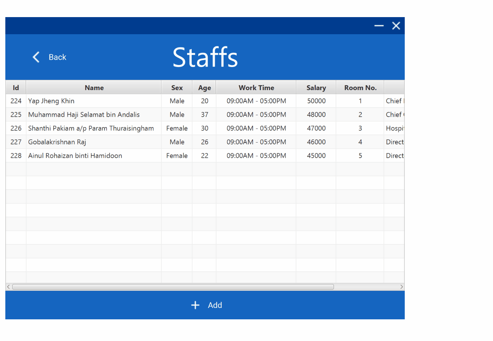

# Hospital Management Application
Java Project on Hospital Management System

The GUI program can be downloaded in the releases section.

## Learning objectives
1. To familiarize myself with OOP concepts using Java.
2. To learn some basic & general concepts, philosophy and principles about UX design. 

## IDE/Plug-in used
- Eclipse SDK Version 2020-09 (4.17)
- [e(fx)clipse (JavaFX Tooling and Runtime for Eclipse and OSGi)](https://www.eclipse.org/efxclipse/index.html)

## List of Dependencies used
- Java SE 8
- JavaFX 8
- [JFoenix for Java 8](https://github.com/jfoenixadmin/JFoenix)

## Credits
- I use icons from [here](https://material.io/resources/icons/).
- I use color palette picker from [here](https://material.io/resources/color)
- I learn about basics of UX from [here](https://material.io/resources/get-started#design)

## Program functions
1. View and add records of staff, doctor, patient, medical, laboratory, and facility.

## Demonstration

## Hightlight features:
1. Input validation
2. Autocompletion

